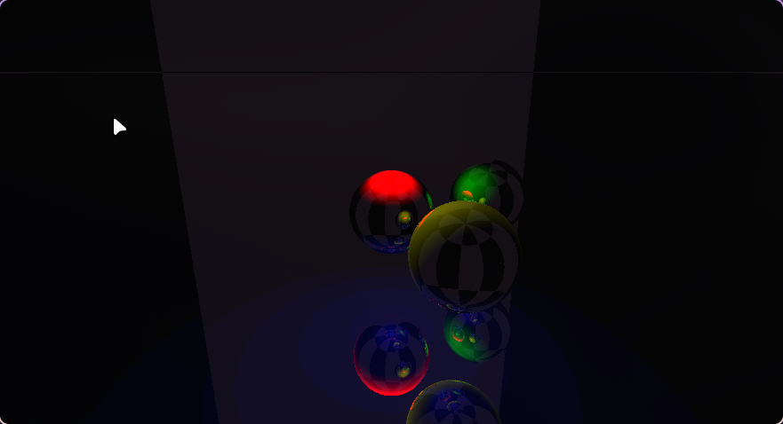

# opensys

realistic ray tracer based on photonics.

> [!CAUTION]
> heavily work in progress. not abandoned, will be picked up at any (random)
> point of interest. contributions are encouraged within moderation.

## comparison to PBR ray tracing
- instead of albedo, metallic, roughness, etc. it aims to use a single complex
  function of refraction based on wavelength.
  - real value determines reflectance/transmittance.
  - imaginary value determines absorption.
- fully realtime, written entirely in the fragment shader.
- keywords:
    - [sellmeier equation](https://en.wikipedia.org/wiki/Sellmeier_equation)
    - [complex permittivity](https://en.wikipedia.org/wiki/Permittivity#Complex_permittivity)

## TODO
- [x] sphere and plane test
- [x] shading
- [x] reflection
- [x] z ordering
- [ ] shadows
- [ ] wavelength implementations
- [ ] complex value algebra
- [ ] transmission
- [ ] absorption

